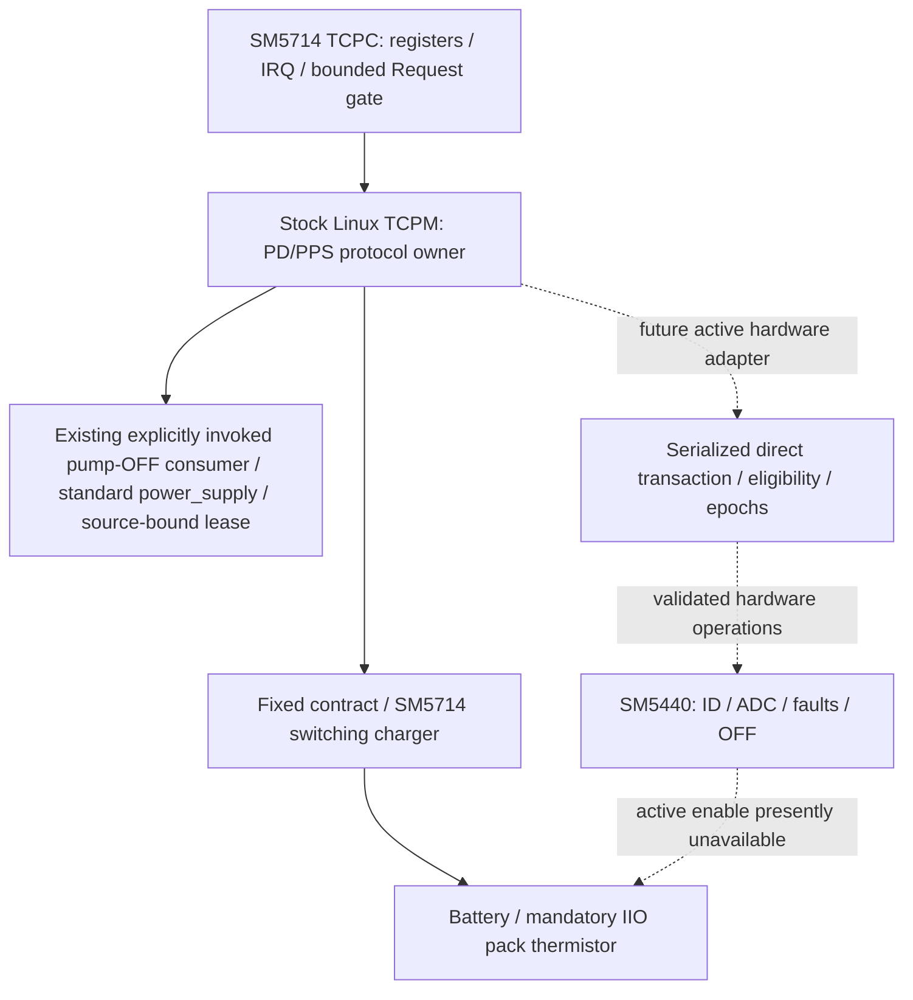

# X710 mainline charging architecture

Current owner direction (2026-10-06): use the same-model Fedora charging source.
The separately built `sm5440-fedora.c` ports its real continuous ADC/PPS/pump
worker, adapted to the existing source/lease APIs and1.8A initial cap. See
[Fedora source port](X710_FEDORA_CHARGING_PORT.md). The prior custom single-shot
ADC/native activation route below is historical and is not the new candidate's
runtime. Test326 stopped at its actual100ms request timeout and exact Test323
boot/modules were restored. Device3f4cf492 remains accepted ordinary Test323.
The new driver defaults OFF and is not physically accepted or deployed yet.
Full higher-power charging remains unaccepted; no new ADC repair round is planned.

Current continuation (2026-10-03): Test303 supplies an explicitly invoked kernel pump-OFF
PPS consumer, real provider integration, PM drain and source-bound authorization
release; see [owned consumer](X710_OWNED_PPS_CONSUMER.md). The active core's
pump actuator/OCP/physical ADC qualification is still incomplete. The historical
Test256 design below is not a claim of current device identity: current device retains
Test308 ordinary recovery accepted in Test311 and restored after Test313, not Test255. No automatic PPS/direct charging.

Read [vendor audit](X710_VENDOR_CHARGING_AUDIT.md),
[register audit](SM5440_REGISTER_AUDIT.md), and
[transaction design](SM5714_SM5440_HANDOFF.md) first. This design precedes code
changes and permits offline development only. Test255 is the frozen fixed-PD
behavioral reference, not the current device image. Test311 accepted one ordinary
PC-USB candidate boot/15s endpoint with actual programming witness. Test313's
isolated ENHIZ/ADC conversion stopped on live REVBLK/nonzero IBUS and restored
that accepted boot+181 once; current final1f1e01bf is normal. Read current
AGENT.md and [Test313 results](../reference/boot-tests/test-313-adc-condition-comparison/RESULTS.md)
for authoritative device status. Ordinary recovery is not ADC/PPS/pump acceptance.

## Frozen baseline and staged outputs

Historical fixed-PD baseline commit
`ebf4af1c098af1179c69d6f59dcdcb756d03e21a` is identified by Test255's
config/DTB/modules/manifests. Historical image retention follows AGENT.md;
an old recorded image path is not proof that the image still exists. Preserve Linux7.2-rc3,
CONFIG_HVC_DCC=n, UPower/USER_NS/container gates, SM5714/ADC5 Gen3, Test253
userspace, CPU/GPU/Wi-Fi/USB/rootfs and cmdline. Default connector remains
only fixed5V1800mA/9V1500mA, Sink/Device, DWC3 peripheral. A refactor build is
a NEW unaccepted image even if config and DTB are identical.

* Stage3A: cache lifetime, bounded fixed/PPS pure validation, safety helpers;
  default runtime still rejects every APDO. No SM5440 binding or PPS request.
* Stage3B: separately named passive profile builds the SM5440 driver and enables
  only its existing hub3/0x63 node. Pump-off verification/ID/ADC/fault decode;
  no PPS and no charger handoff. Preserve hub3 400kHz GPI DMA, never FIFO/PIO.
* Stage3C: compile and host-test transaction policy with direct activation
  unavailable. Missing actual OCP/sensor/ADC/abort acceptance blocks active use.
* Stage3D/E: future independently registered PPS-pump-off and conservative pump
  acceptance, then increments2/2.25/2.5/3A. Not enabled or deployed here.

Reuse the existing incremental directory for each active profile after freezing
its previous formal outputs and source/config/toolchain identities. Keep
independent profile outputs and module providers distinct; a new test number
does not require a copied full tree. Do not edit resolved .config, overload CPU
diagnostic profiles, overwrite historical evidence, or combine passive and
active board changes into a default build. AGENT.md's current storage rules
supersede the original per-stage directory recommendation.

| Component | Implementation evidence | Outstanding acceptance |
| --- | --- | --- |
| Ordinary fixed charging | Stage1/Stage2 hardware evidence; Test308 adds exact programming witness and one bounded recovery | Test311 ordinary PC acceptance passed without observed drift; forced/natural recovery branch and fixed9V recovery are separate scopes |
| TCPM PPS protocol adapter | Test302 actual native TCPM power_supply operations and source-bound ownership, compiled and host-tested | No successful physical PPS roundtrip is claimed |
| Pump-OFF PPS consumer | Test303 real battery lease/provider integration and PM cancellation/drain, compiled and host-tested | Genuine physical acquisition must satisfy its100ms admission; slow diagnostic observations cannot substitute |
| Native observation worker | `x710-charge-observer.c` links real source/pack/OFF-fresh providers through one explicitly requested ordered worker; generations, timeout and PM drain are exercised by threaded host tests | Does not complete the live control adapter or grant ADC/calibration/OCP acceptance; no automatic requests or physical deployment |
| Native hardware executor | `sm5440_native_control()` binds real map/IO/poller ownership, converter/settings/WDT and terminal cleanup under its isolated profile; PM and lifetime are host-tested | Native activation unavailable; physical ADC/OCP acceptance still required |
| Native coordinator | `x710-charge-controller.c` retains actual native ownership/ADC/source/pack/switching lease/TCPM transaction on one ordered queue; temporary pause/resume, 20ms monitor/4s retarget, once-only terminal cleanup/PM/faults tested with mock grants | Kernel activation flags remain closed; no device deployment; physical ADC/calibration/current/protection/cutoff/PPS qualification remains unfinished |
| SM5440 passive transport | Readback, ADC decoding, OFF checks and passive physical observations | Test313 close single voltage pair but live REVBLK/nonzero OFF IBUS: STOP; complete operating context, independent calibration and physical freshness remain unresolved |
| Direct transaction engine | Actual C entry/refresh/retarget/monitor/fallback/PM functions exercised with faulting host adapters | No live pump-ON actuator, approved active protection or physical cutoff acceptance |

These are separate prerequisites. Passing ordinary recovery does not grant PPS;
a pump-OFF protocol roundtrip would not grant pump-ON or higher current. Keep
the accepted fixed path and exact paired rollback available at each transition.

## Ownership

Do not replace the existing battery booleans with one enum that loses the
independent suspended/fault/claimed/standby gates. A derived mode/snapshot can
improve observability; a separate transaction owns direct transitions. Share
small pure bounds/encoding/fault helpers with executable host tests. Hardware
I/O remains in subsystem drivers, not a generic callback hierarchy.

No runtime user-facing fast-charge/sysfs/module parameter is added. The passive
power_supply is read-only. There is no raw-register debugfs write interface.
Do not claim guessed IBAT: SM5440 has IBUS but no independently verified IBAT
ADC; battery current comes from SM5714 gauge, and2*IBUS is an estimate only.

## Lock/lifetime contract

Existing nested order is TCPM port lock -> TCPC transport lock (where needed)
-> sm5714_companion_lock -> battery chg_lock. Gauge SRAM lock is acquired
within serialized gauge operations and must never call TCPM. No battery
operation calls back into TCPM. IRQ receive/reset notifications queue work;
they do not synchronously acquire the port mutex (pinned tcpm.c).

Future policy worker snapshots its state under its own short mutex, releases
it before power_supply/TCPM operations or long ADC waits, then rechecks the
connection epoch. SM5440 io_lock is never held across negotiation/settle waits
or calls into battery/TCPM. No cross-device locks may nest in reverse order.
Short baseline Q4 ramp(usleep_range, at most a few ms) is preserved; new
hundreds-of-ms waits must not extend that lock hold.

The native observation worker already implements this acquisition-side pattern:
publication mutex only around request/result state, native provider operations
outside that mutex, single in-flight request, late-publication invalidation and
PM drain. It does not call the transaction engine or actuator. See
[X710_NATIVE_CHARGE_OBSERVER.md](X710_NATIVE_CHARGE_OBSERVER.md). Completion of
the actual control worker and its transactional fault/PM/fixed restoration is
still required; this data worker must not be reported as direct-charge readiness.

Source cache and attach epoch are protected by the TCPC mutex. Init, RX-off,
hard/soft reset, detach, fault and unbind invalidate capabilities. Reset/detach
IRQ must invalidate before processing simultaneous stale RX. A stale worker or
source offer cannot authorize a Request on a new connection. Unbind marks
unavailable, stops IRQ/work, latches off and unpublishes references before free.
Generation change is cancellation, never an instruction to restore an old
contract or turn on switching on a new connection.

## Defaults and acceptance

Unknown/error/invalid ADC/temp/PM/detach => direct OFF. If OFF cannot be
verified, do not change voltage or enable switching; record a latched fault.
Vendor defaults with disabled hardware OCP are not silently treated as safe
protection. Full active policy remains NOT READY pending the staged tests and
documented sensor/OCP requirements. Offline tests/builds prove bounded code
behavior, not battery or hardware safety. Historical pure-engine results are in
Test256/Test257. Actual native adapter and owned pump-OFF consumer qualifications
are recorded separately in Test302 and Test303; neither establishes physical
direct-charge readiness.

The actual hardware-session boundary is documented in
[SM5440_NATIVE_CONTROL.md](SM5440_NATIVE_CONTROL.md). It is separate from the
historical offline-policy profile and does not complete active deployment.
The bound OFF coordinator is documented in
[X710_NATIVE_CONTROLLER.md](X710_NATIVE_CONTROLLER.md). Its real cleanup and
source-bound release do not grant active protection or higher-power charging.

## Native real pack-current admission (2026-10-05)

The existing SM5714 gauge current is now retained with its original acquisition
bracket, checked independently on both reads, and forwarded as mandatory signed
current facts to transaction/actuator/supervisor/paused resume. Native result
telemetry records the last attempted read separately from its health/freshness.
The conservative signed ±3.6A bringup refusal envelope is not vendor OCP or a
current programming increase; ordinary fixed charging is unchanged. Actual-C
current/read/fallback/native mapping tests and ARM64 qualification are recorded
under `reference/charging/x710-pack-current/`. Private native/OCP grants remain
closed. Physical current/gauge freshness/cutoff acceptance is still required.
See [pack-current design](X710_PACK_CURRENT_GUARD.md) for source/units/bounds.
