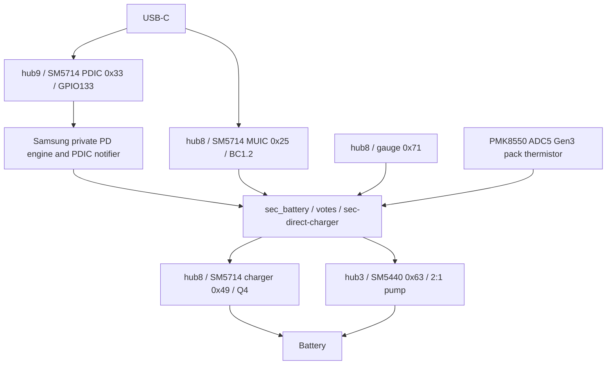

# X710 wired charging: vendor / Fedora / mainline audit

Audit start: 2026-09-29, `test` at
`ebf4af1c098af1179c69d6f59dcdcb756d03e21a`. This is offline work. No device
command is part of this audit. Test255 attempt03 is the frozen, bounded,
hardware-observed fixed-PD reference; it does not prove physical input watts,
all cold/power paths, or direct-charge safety.

## Evidence and selection

Samsung sources are owner-supplied, read-only, under
`/home/ms/Samsung/kernel_platform/msm-kernel`. `common` contains the generic
kernel, not the complete Samsung charging stack. File hashes, revision identity,
and the baseline artifacts are registered in Test256 `sources.json` and
`baseline.json`. The same-model Fedora remote HEAD was checked against
`ab123e7d1dbc0cbcd35661f9761197e977b15aa9`; no newer HEAD was found.

The evidence chain is more than a name match:

* `arch/arm64/configs/vendor/kalama-gki_defconfig` selects CHARGER_SM5714,
  MFD_SM5714, FUELGAUGE_SM5714, MUIC_SM5714, PDIC_SM5714, CHARGER_SM5440,
  and DIRECT_CHARGING as modules.
* `drivers/Kconfig`, `drivers/Makefile`, and each subsystem Kconfig/Makefile
  connect those selections to the implementations below.
* `arch/arm64/boot/dts/samsung/galaxytab/gts9wifi/Makefile` selects the gts9wifi
  r00/r01/r02/r04 board overlays for kalama. The r02 and r04 overlays connect
  `sec-direct-charger` to `sm5714-charger` and `sm5440-charger`, with PDIC at
  0x33, MFD at 0x49, and SM5440 at 0x63. Board revision differences are not
  a license to assume every property is validated on this tablet.
* `drivers/mfd/sm/sm5714/sm5714_core.c` creates charger/fuelgauge/MUIC cells
  and dummy I2C clients. A generated platform-node `status = "disable"`
  string does not establish that the dynamically instantiated charger is unused.

Selected implementation roots, relative to `msm-kernel`:

| Component | Implementation | Evidence class |
| --- | --- | --- |
| MFD/I2C/IRQ | `drivers/mfd/sm/sm5714/`, `include/linux/mfd/sm/sm5714/` | HARDWARE FACT |
| Switching charger/Q4 | `drivers/battery/charger/sm5714_charger/` | HARDWARE FACT + BOARD POLICY |
| Gauge/SRAM | `drivers/battery/fuelgauge/sm5714_fuelgauge/` | HARDWARE FACT |
| BC1.2 | `drivers/muic/sm/sm5714/` | HARDWARE FACT + VENDOR FRAMEWORK |
| TCPC transport | `drivers/usb/typec/sm/sm5714/sm5714_typec.c` | HARDWARE FACT |
| Private PD engine | `sm5714_pd.c`, `sm5714_policy.c` in that directory | VENDOR FRAMEWORK |
| Pump/protections/ADC | `drivers/battery/charger/sm5440_charger/sm5440_charger.c/.h` | HARDWARE FACT |
| Pump CC/CV algorithm | `sm5440_direct_charger.c/.h` in that directory | BOARD POLICY + VENDOR FRAMEWORK |
| Handoff/eligibility | `drivers/battery/common/sec_direct_charger.c/.h` | BOARD POLICY + VENDOR FRAMEWORK |
| Thermal/step charging | `sec_battery_thermal.c`, `sec_step_charging.c`, `sec_battery_dt.c` | BOARD POLICY + VENDOR FRAMEWORK |



## Three-way mapping

`[VENDOR]` means source evidence, not new mainline hardware acceptance.
`[FEDORA]` means same-model reference implementation, not our acceptance.
`[MAINLINE]` means framework or implemented behavior. `[MEASURED]` is bounded
Test252/255 evidence. `[BRINGUP_LIMIT]` is deliberately conservative policy.

| Feature | Samsung vendor | Fedora X710 | Current mainline at audit start | Classification |
| --- | --- | --- | --- | --- |
| Charger probe | MFD platform cells, register initialization | AP-direct combined I2C driver | AP-direct charger + dummy gauge/MUIC clients | HARDWARE FACT / MAINLINE FRAMEWORK |
| SM5714 init | `chg_init` and reset recovery | register helpers | identity, Q4 safety, float programming | HARDWARE FACT |
| Float voltage | X710 4440mV; CHGCNTL4 bits5:0, code45 | 4440mV | 4440mV at probe and every configure, readback | BOARD POLICY; [VENDOR][MEASURED] |
| Input current | cable/current votes, AICL | BC1.2/fixed/PD policy | SDP500, CDP1500, DCP1800; fixed9V<=1500 | BOARD POLICY; [MEASURED] |
| Battery current | voted cable/thermal/step limits | ordinary vs direct separated | ordinary <=2100mA; reduced500mA | BOARD POLICY; [MEASURED] |
| Q4 | CNTL1 bit3 with input-current ramp | separate direct/switching gate | disable first, lower input, float/readback, enable last | HARDWARE FACT |
| Watchdog | SM5714 90s maintenance; SM5440 30s | maintenance workers | SM5714 expired status stops charge; no new WDT programming | HARDWARE FACT / NOT PORTED |
| Health | IRQ/status/private health | power_supply/status | charger faults and thermal fail closed | HARDWARE FACT / MAINLINE FRAMEWORK |
| Thermal | zones/votes/hysteresis/mixed sensors | pack/DC gates | NORMAL/REDUCED/STOP, mandatory pack sensor | BOARD POLICY |
| Pack thermistor | board ADC/thermistor table | IIO Gen3 | PMK8550 ADC5 Gen3 channel0x144 | HARDWARE FACT |
| BC1.2 | MUIC notifier cable types | device type bits | SDP/CDP/DCP directly classified | HARDWARE FACT |
| Fixed PD | ordinary PD power budget15000mW | TCPM fixed9V switching | TCPM fixed5V<=1800 /9V<=1500mA | BOARD POLICY / MAINLINE FRAMEWORK |
| PPS | private PD/PPS engine | TCPM standard power_supply | disabled, no APDO in connector | VENDOR vs MAINLINE FRAMEWORK |
| APDO selection | source caps/private select API | TCPM + limits | unsupported at baseline | MAINLINE FRAMEWORK, planned guarded transport |
| PPS refresh | `support_pd_remain`, CC/CV repeat requests | periodic pump-off/settle refresh | absent, fixed path only | BOARD POLICY, separate safety dependency |
| SM5440 init | ID low nibble1; protection sequence | reset/program/ADC/pump | DT node disabled, no driver | HARDWARE FACT |
| Direct entry | BUCK_OFF then PRESET/APDO/ADC/config/pump | eligibility then Q4/PPS/ADC/pump | absent | BOARD POLICY |
| Direct exit | pump OFF before voltage change, fixed9V then switching | pumpOFF/PPSexit/switching | absent | HARDWARE FACT + BOARD POLICY |
| Fault recovery | status/IRQ/errors, UVLO2s retry, software OCP | fail/fallback/backoff | SM5714 first TCPC fault latched; no pump | HARDWARE FACT + BOARD POLICY |
| Suspend/resume | vendor wakelocks and subsystem PM | worker shutdown/fallback | Q4 stopped on suspend, re-evaluate resume | MAINLINE FRAMEWORK; preserved |
| SOC | direct end default95%; UI/store policies | >=5 and <90% | no direct SOC gate | BOARD POLICY, conservative future >=5,<80 |
| VBAT | manager X710 DT3400mV (generic default3500); pump algorithm3300mV | >=3500,<4350mV | float4440mV, no pump | BOARD POLICY; future3500..4300 |
| Pack direct temperature | X710 manager >180 and <420 deci°C | >=100,<420 | no direct charging | BOARD POLICY; future200..380 |
| Termination/recharge | topoff current/timer, autostop, votes | simpler ordinary path | respect FULL; inherited timer/topoff not reprogrammed | NOT PORTED; preserve baseline |
| Cable compensation | X710 r_ttl320000uohm; initial+200mV | 320mohm/+200mV | absent | BOARD POLICY; [VENDOR], not measured cable resistance |

## Thermal policy, limits, and missing sensor evidence

X710 r04 properties and `sec_bat_set_threshold()` define:

| Zone | Base entry boundary (deci°C) | Recovery modification | Vendor current/voltage behavior |
| --- | --- | --- | --- |
| COLD | <=0 | cold/cool thresholds +19 | stop charge |
| COOL3 | 0..50 | cool boundaries +19 | wire current777mA, low-temp float4440mV |
| COOL2 | 50..150 | upper cool boundaries +19 | wire current1958mA |
| COOL1 | 150..180 | normal entry +19 | wire current7000mA |
| NORMAL | 180..420 | base thresholds | cable/step/vote policy |
| WARM | >=420 | normal return threshold -19 | wire current5640mA, high-temp float4200mV |
| OVERHEAT | >=500 | warm/overheat boundaries -19 | stop/recovery votes |

The exact constant is **19 deci°C**, not an assumed20. Boundaries are tested
by `sec_bat_thermal_check`; the table is a compact description, not a replacement
of its order/debounce logic. These large zone currents belong to vendor aggregate
policy and must NOT become ordinary switching input/battery limits. Existing
mainline Stage1 thermal behavior remains untouched in this task.

Direct eligibility independently rejects battery temperature <=180 or >=420.
`sec_direct_charger_parse_dt()` derives this from the same board warm/normal
and cool1/normal properties. Pump temperature/charger thermal throttling is a
different check: r04 has dchg_high_temp650/recovery420 and charger800/recovery770.
The r04 `dchg_high_batt_temp900` property is not permission to charge the pack at
90°C: manager and battery zones still apply. USB temperature check type is0 in
this overlay. Do not fabricate USB/charger/sub-pack sensors; their mappings and
calibration are not accepted in our port. Dependent mixed-temperature/LRP
optimization stays NOT PORTED. Initial future direct admission is20..38°C;
42°C is a hard first-bringup stop, with no deliberate heating test.

The owner-reported capacity is8400mAh typical. Existing mainline uses8160mAh
rated and must retain it. The supplied r02/r04 generated overlays also contain
`battery_full_capacity=0x2648` (9800), inconsistent with the frozen design
record. Its relationship to the final shipped overlay/gauge/TTF policy is
UNKNOWN; it is not evidence to overwrite actual battery design capacity.

## Fixed PD and PPS algorithm

X710 r04 ordinary `pd_charging_charge_power=15000mW`, input-current max3000mA,
and unrelated fast-power policy45000mW are separate. Current validated
fixed9V ceiling1500mA (13.5W policy input) stays frozen. Neither a source3A
advertisement nor the vendor45W figure authorizes a current increase.

Vendor `pd_preset_dc_work()` computes initial current approximately target
battery-current/2, bounded by APDO and minimum1000mA. Initial voltage is:

```
2 * VBAT_mV + (requested_mA * r_ttl_uohm)/1000000 + 200mV
```

Vendor rounds PPS20mV/50mA to nearest; the mainline bringup helper will round
voltage up only within bounds and current down to avoid exceeding a ceiling.
Minimum TA voltage8200mV, algorithm ceiling11000-500=10500mV. Later CC/CV
uses measured VBUS/IBUS, step reductions, power limit and offset adjustment;
it is more than a one-shot formula. The current Stage2 9V maximum remains
distinct from a future isolated PPS candidate's10500mV maximum. No new APDO
is installed/enabled by this offline task.

Vendor CC/CV `support_pd_remain` reissues requests on approximately1100/2500ms
paths. I found no equivalent pump-off-before-every-refresh workaround in these
wired vendor paths; the only explicit REVBLK-disable write found is in bypass,
which is excluded. Vendor exit explicitly says pump OFF before changing TA
voltage to avoid reverse current. Fedora's measured refresh REVBLK/TCPC hang
therefore remains an additional constraint: pumpOFF -> PPSrequest -> physical
VBUS settled -> pumpON. Do not claim the vendor establishes that workaround
is unnecessary.

Vendor `sm5440_charger_suspend()`/`resume()` only manage IRQ wake and IRQ
disable/enable; they do not themselves stop the pump or exit PPS. The driver
also registers a charging wakeup source. Those Android wake-lock assumptions
are not a portable PM safety guarantee. Our proposed transaction must drain
work, verify pump OFF and leave PPS before suspend; this stricter behavior is
[MAINLINE/BRINGUP_LIMIT], not an already implemented vendor-equivalent adapter.

## Linux7.2-rc3 ownership and gaps

The actual pinned `tcpm.c`, `tcpm.h`, `pd.h` were inspected. TCPM selects PPS
APDOs, builds20mV/50mA RDOs, owns the negotiation/PS_RDY/reset states, and
exposes standard power_supply ONLINE(FIXED1/PPS2), CURRENT_NOW/VOLTAGE_NOW.
Those are contract values, not ADC measurements. Setter paths serialize with
swap_lock/port.lock, release port.lock while waiting for completion, and can
return EAGAIN/ETIMEDOUT. A coordinator must not hold charger/TCPC locks during
these setters. No periodic PPS keepalive worker was found in this pinned TCPM;
consumer refresh must be designed/tested separately. This is different from
duplicating the PD protocol engine. TCPM also enforces operating-sink power;
the future APDO profile and request order need dedicated acceptance.

Fedora's retained Sink/DFP and Source/UFP TCPM patches solve dock/warm-role
retention. They are not fixed Sink/Device or basic PPS protocol prerequisites
and are not imported. No TCPM core, DWC3, gadget or Test253 adbd changes.

Important newly exposed gaps: Source_Capabilities cache is not cleared on all
reset/fault paths; malformed/extended Request validation is incomplete; IRQ RX
can precede detach/reset invalidation; direct hardware OCP cannot be assumed
available. Vendor probe explicitly sets `need_to_sw_ocp=1` (hardware OCP not
usable) and init0xF2 disables IBUSOCP/IBATOCP/THEM. Blindly copying its init
would be unsafe. Active pump enable stays unavailable until software OCP,
sensor/fault timing, ADC validity and transaction cancellation are accepted.

## Not ported

Samsung votes/notifiers/extprops/private PD framework, SIOP/LRP UI hooks,
battery-care/store/age UI behavior, wireless, reverse boost, bypass, OTG,
dock/DeX, DP/PS5169/SBU are not imported. Full vendor CC/CV/step charging and
mixed sensor behavior are not hardware-accepted. Future progressive admission
is conditional on passive/ADC/PPS-off tests; source capability is not validation.
